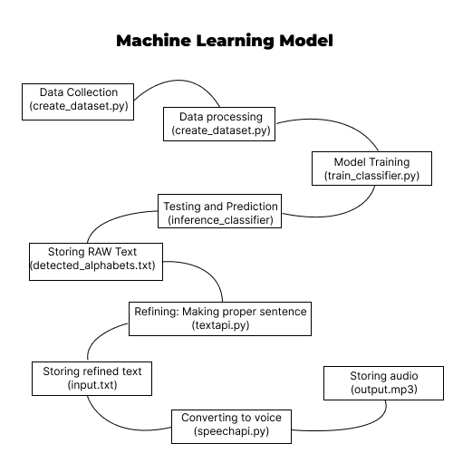
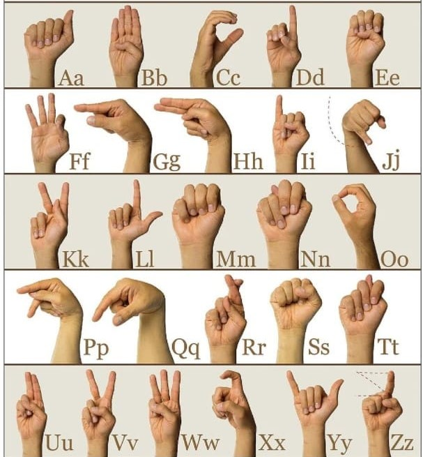

# VisibleVoice.ai

### by [Girendra Singh](https://github.com/Giru-03)
### with [Arshlaan](https://github.com/sa778888), [Sahil Murhekar](https://github.com/sahilmurhekar),  and Aryan Chopra
### from TamilNadu, India

## About the Project

VisibleVoice.ai is a web application designed to facilitate communication for individuals who use sign language. The project leverages frontend technologies (HTML, CSS, JS) for the user interface and interaction, while the backend is powered by Django framework for processing and interpreting the sign language gestures.

## Overview

VisibleVoice.ai aims to bridge communication barriers by providing a platform where sign language users can interact more seamlessly with others. The application detects sign language through a webcam or camera input, processes them in real-time, and provides corresponding textual or auditory output.

## Features

- **Sign Language Detection:** The application utilizes computer vision techniques to recognize and interpret various sign language gestures.
- **User-Friendly Interface:** The frontend is designed with accessibility in mind, featuring clear instructions and intuitive controls.
- **Real-Time Processing:** The system processes gestures in real-time, enabling smooth and immediate communication.

## Technologies Used

### Frontend
- **HTML:** Provides the structure and semantics of the web application.
- **CSS:** Styles the HTML elements for a visually appealing and user-friendly interface.
- **JavaScript:** Implements interactive features and communicates with the backend for gesture processing.

### Backend
- **Django Framework:** A high-level Python web framework that handles backend logic, including gesture recognition and interpretation.

### Sign Language Detection and Voice Conversion with Real-Time Machine Learning
This project aims to develop a real-time system for sign language detection and conversion to spoken voice using machine learning techniques.

### Project Description
This system utilizes a combination of computer vision and machine learning to achieve its goal. The core functionalities are:

- **Computer Vision:** OpenCV is used for video capture, hand detection, and image processing tasks.
- **Hand Pose Estimation:** MediaPipe provides pre-trained hand pose estimation models for accurate landmark detection.
- **Machine Learning:** TensorFlow and Scikit-Learn are potential libraries for training and deploying the sign language recognition model.
- **Model Persistence:** Pickle is used for saving and loading trained models.
- **Voice to Image Model:** Utilizes Whisper API and IPython for converting voice to images.

## Installation

To run the project locally, follow these steps:

1. Clone the repository:
    ```sh
    git clone https://github.com/your-username/visiblevoice.ai.git
    ```

2. Navigate to the project:
    ```sh
    cd visiblevoice.ai
    ```

3. Install dependencies:
    ```sh
    pip install -r requirements.txt
    ```

4. Run the Django development server:
    ```sh
    python manage.py runserver
    ```

## Usage

1. **Sign Language Detection**: The application captures video input from a webcam and processes it to detect sign language gestures.
2. **Text and Speech Output**: The detected gestures are converted into corresponding textual or auditory output.

## Images

### Workflow


### Sign Language Gestures


### Screenshots
#### Home Page


#### Dashboard


#### Sign Language Detection


